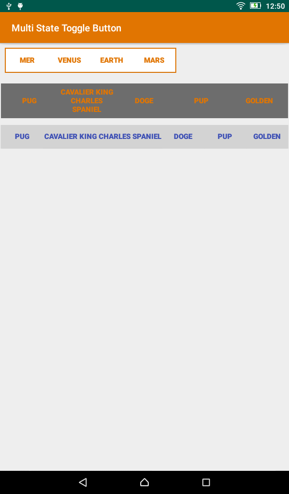

[](https://jitpack.io/#jampez77/multistatetogglebutton) [](http://www.repostatus.org/#active) [](https://GitHub.com/jampez77/multistatetogglebutton/stargazers) 

# My Contributions
### This is a fork of the brilliant [Multi State Toggle Button](https://github.com/jlhonora/multistatetogglebutton) by [Jose Luis Honorato](https://github.com/jlhonora). This is not all that different from his repo in all honesty. I have just added a few customisable options.

Multi State Toggle Button
=========================

A simple multi-state toggle button for Android.



## Usage ##

```
dependencies {
    implementation 'com.github.jampez77:multistatetogglebutton:0.3.1'
}
```

Then in your activity's XML:

```xml
<LinearLayout xmlns:android="http://schemas.android.com/apk/res/android"
    xmlns:mstb="http://schemas.android.com/apk/res-auto"
    android:layout_width="match_parent"
    android:layout_height="match_parent"
    android:orientation="vertical"

	<com.jampez.multistatetogglebutton.MultiStateToggleButton
		android:id="@+id/mstb_multi_id"
		android:layout_width="wrap_content"
		android:layout_height="wrap_content"
		android:layout_marginTop="10dip"
		mstb:values="@array/planets_array"
		mstb:mstbPrimaryColor="@color/gray"
                mstb:mstbBorderColor="@color/black"
                mstb:mstbSecondaryColor="@color/blue"/>
</LinearLayout>
```

### Colors

You can change change colors via xml (see above) or programmatically :
```java
MultiStateToggleButton button = (MultiStateToggleButton) this.findViewById(R.id.mstb_multi_id);
button.setColorRes(R.color.color_pressed, R.color.color_released);
```

If you don't specify any values, default colors are taken from `?attr:colorPrimary` and `?attr:colorControlNormal`
## Others

If you need a callback for when the value changes then add this to your code:

```java
MultiStateToggleButton button = (MultiStateToggleButton) this.findViewById(R.id.mstb_multi_id);
button.setOnValueChangedListener(new ToggleButton.OnValueChangedListener() {
	@Override
	public void onValueChanged(int position) {
		Log.d(TAG, "Position: " + position);
	}
});
```

Be sure to declare an array of strings called `planets_array` in your `strings.xml`:

```xml
<string-array name="planets_array">
	<item>Mer</item>
	<item>Venus</item>
	<item>Earth</item>
	<item>Mars</item>
</string-array>
```

The values can also be specified programmatically, plus other options:


```java
MultiStateToggleButton button = findViewById(R.id.mstb_multi_id);


// With an array
CharSequence[] texts = new CharSequence[]{"abc", "def"};
button.setElements(texts);

// With a resource id
button.setElements(R.array.planets_array);

// Resource id, position one is selected by default
button.setElements(R.array.dogs_array, 1);

// Multiple elements can be selected simultaneously
button.enableMultipleChoice(true);
```

In order to use arbitrary buttons (e.g. `ImageButton`)

```java
MultiStateToggleButton button = findViewById(R.id.mstb_multi_id);
ImageButton button1 = (ImageButton) layoutInflater.inflate(R.layout.btn_image, button, false);
button1.setImageResource(imgResourceId1);
ImageButton button2 = (ImageButton) layoutInflater.inflate(R.layout.btn_image, button, false);
button2.setImageResource(imgResourceId2);
ImageButton button3 = (ImageButton) layoutInflater.inflate(R.layout.btn_image, button, false);
button3.setImageResource(imgResourceI3);

View[] buttons = new View[] {button1, button2, button3};
button.setButtons(buttons, new boolean[buttons.length]);

```
